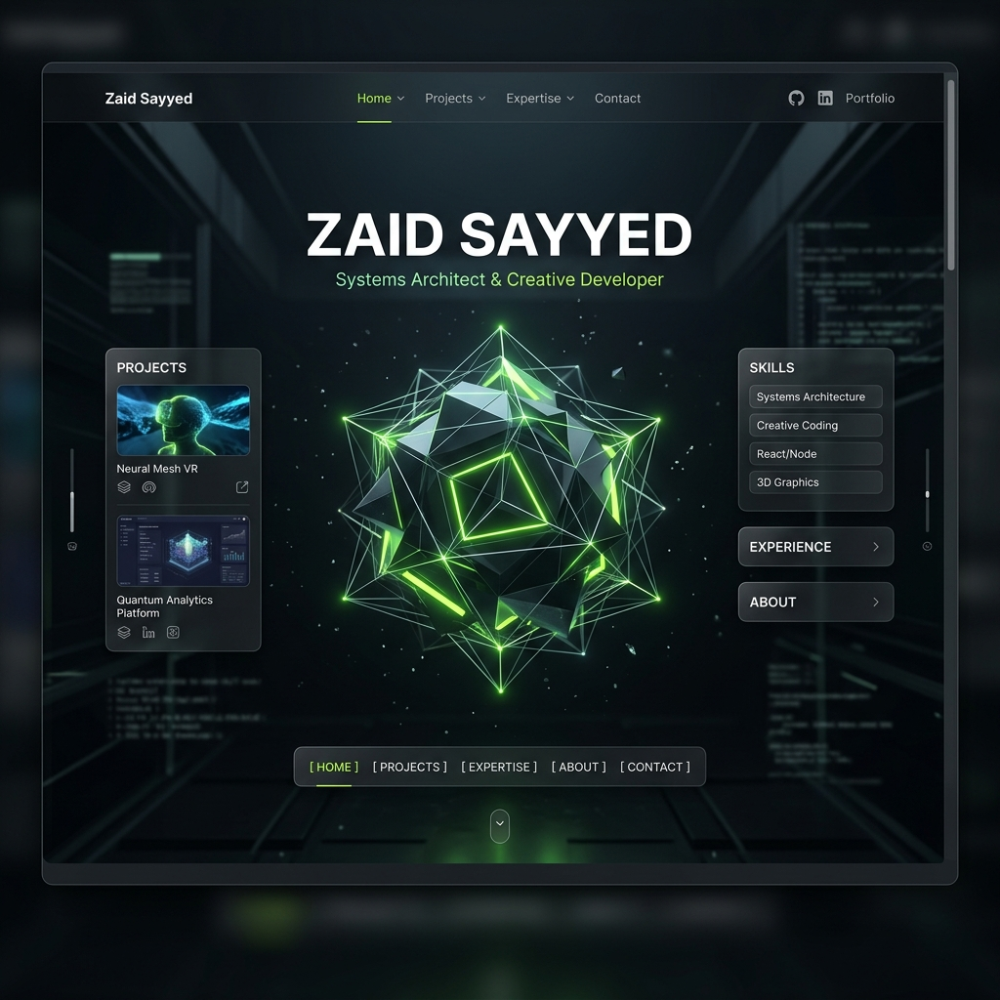
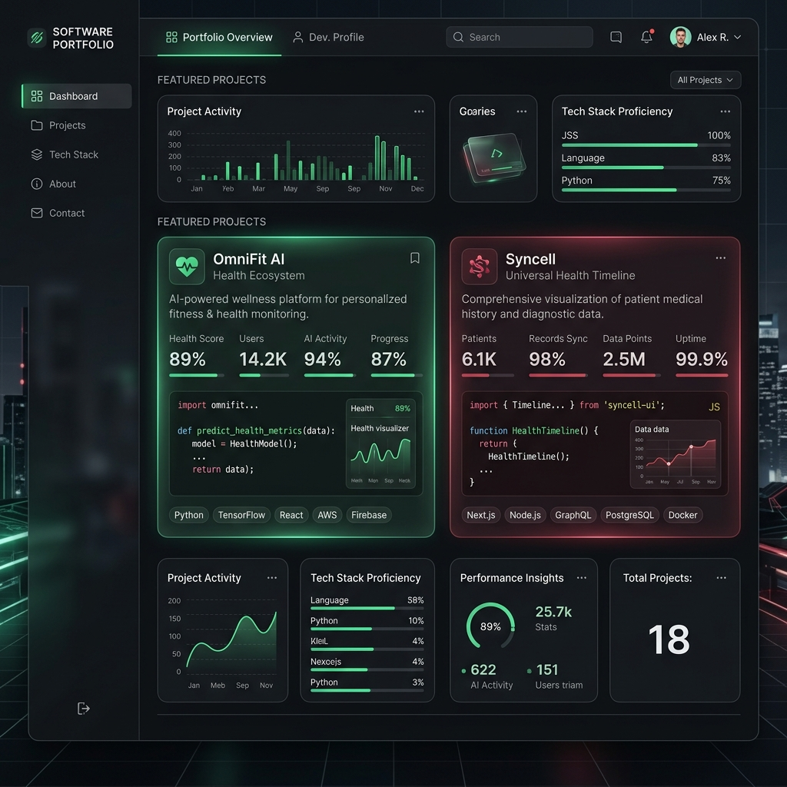
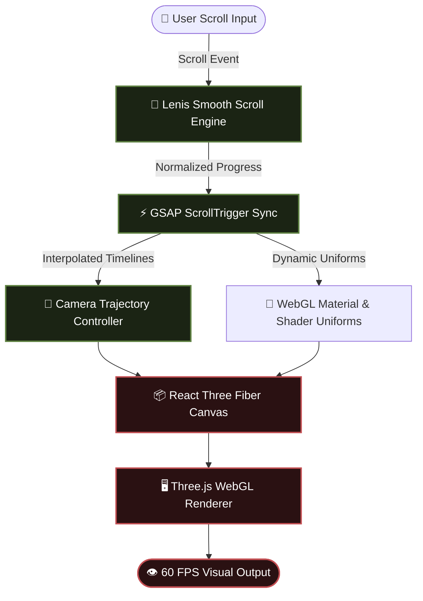
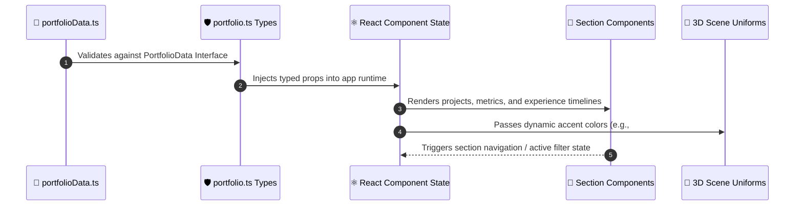

# ✨ Zaid Sayyed — 3D Interactive Portfolio & Systems Hub

[](https://reactjs.org/)
[](https://www.typescriptlang.org/)
[](https://threejs.org/)
[](https://docs.pmnd.rs/react-three-fiber)
[](https://vitejs.dev/)
[](https://tailwindcss.com/)
[](https://greensock.com/gsap/)

> **"Minimal code, maximum impact. Architecting scalable systems and crafting immersive digital experiences."**

Welcome to the official repository for **Zaid Sayyed's 3D Interactive Portfolio**. This project represents an intersection of high-performance system design, modern full-stack web engineering, and cutting-edge 3D WebGL graphics.

---

## 📸 Visual Showcase & Previews

<div dir="auto" align="center">

| 🌌 **3D Interactive Hero Experience** | 💼 **Projects & Systems Showcase** |
| :---: | :---: |
|  |  |
| *Mathematical camera paths & floating WebGL core* | *Interactive project cards & real-time metrics* |

</div>

---

## 🏗️ System Architecture & Diagrams

### 1. **Graphics & Animation Pipeline**
The engine synchronizes smooth inertia scrolling with mathematical 3D camera tracks and real-time WebGL frame renders.



---

### 2. **Component Hierarchy & Layout Flow**
The application decouples fixed 3D spatial canvases from reactive 2D DOM overlays to guarantee high-frequency frame rendering without layout thrashing.

```mermaid
graph TD
    %% Root
    App[📱 App.tsx Root]

    %% Sub-trees
    subgraph ThreeJS ["🌌 3D WebGL Realm"]
        SceneContainer[📦 SceneContainer]
        LightRig[💡 Lighting & Environment Rig]
        CoreObject[🔮 Floating 3D Core Geometry]
        CameraRig[🎥 Camera & Post-Processing]
    end

    subgraph DOMOverlay ["🖥️ 2D React DOM Realm"]
        Navbar[🧭 Navigation & Audio Toggle]
        HeroSec[🚀 Hero Section]
        IdentitySec[👤 Identity & Philosophy Section]
        WorksSec[💼 Works & Featured Projects Section]
        StackSec[⚡ Stack & Core Skills Section]
        ContactSec[📬 Contact & Socials Section]
    end

    %% Connections
    App -->|Mounts| SceneContainer
    App -->|Mounts| Navbar
    App -->|Renders Overlays| DOMOverlay

    SceneContainer --> LightRig
    SceneContainer --> CoreObject
    SceneContainer --> CameraRig

    DOMOverlay --> HeroSec
    DOMOverlay --> IdentitySec
    DOMOverlay --> WorksSec
    DOMOverlay --> StackSec
    DOMOverlay --> ContactSec

    %% Styling
    style ThreeJS fill:#0f140a,stroke:#5f8242,stroke-width:1px;
    style DOMOverlay fill:#1a1012,stroke:#c34e52,stroke-width:1px;
```



---

### 3. **Data Flow & Type Contract Architecture**
All portfolio content, metrics, project highlights, and theme accent colors are managed dynamically through strongly typed data models.



---

## ✨ Core Features & Technical Highlights

- 🔮 **Interactive 3D Core**: Custom 3D elements powered by Three.js and React Three Fiber (`R3F`) with custom post-processing effects.
- 📜 **Scroll-Driven Camera Choreography**: Precise mathematical camera trajectories mapped directly to user scroll position via GSAP ScrollTrigger.
- 🌊 **Inertia Smooth Scroll**: Integrated with **Lenis** to deliver fluid, non-blocking smooth scrolling across desktop and touch displays.
- ⚡ **Performance-First Engine**: Targeted 60 FPS rendering with optimized geometry buffers, efficient re-render prevention, and lightweight WebGL memory management.
- 🛠️ **Strongly Typed Architecture**: Engineered using TypeScript contracts to separate presentation logic from portfolio configuration data.
- 📱 **Adaptive Responsive Layout**: Custom breakpoints and fluid typography crafted with Tailwind CSS for seamless viewing on all devices.

---

## 🛠️ Detailed Technology Stack

| Category | Technologies | Description |
| :--- | :--- | :--- |
| **Core Engine** | `React 18`, `TypeScript`, `Vite` | Fast build pipeline, type-safe components, modern React runtime. |
| **3D & WebGL** | `Three.js`, `@react-three/fiber`, `@react-three/drei` | Declarative 3D scene creation, WebGL shader management, geometry loaders. |
| **Physics & Simulation**| `@react-three/rapier`, `@react-three/cannon` | Rigid body physics and collision simulations. |
| **Animation & Motion** | `GSAP`, `@gsap/react`, `Framer Motion` | Timeline orchestrations, scroll triggers, micro-interactions, spring physics. |
| **Scrolling & UX** | `Lenis` | Smooth inertial scrolling sync for web applications. |
| **Styling & UI** | `Tailwind CSS`, `React Icons`, `PostCSS` | Utility-first styling system, glassmorphism UI tokens, crisp iconography. |

---

## 📁 Project Directory Structure

```text
portfolios/
├── public/                  # Static static web assets
│   ├── draco/               # Draco compression decoders for 3D meshes
│   ├── images/              # Project previews, tech icons, & screenshots
│   └── models/              # 3D GLTF/GLB models & textures
├── src/
│   ├── assets/              # SVGs and component-level graphical assets
│   ├── components/
│   │   ├── common/          # Reusable UI elements (Buttons, Cards, Badges)
│   │   ├── scene/           # R3F Canvases, Lighting, Materials, & 3D Objects
│   │   ├── sections/        # Section views (Hero, About, Projects, Skills, Contact)
│   │   └── ui/              # Navigation bars, sound toggles, and dynamic overlays
│   ├── data/
│   │   ├── portfolio.ts     # Primary data configuration
│   │   └── portfolioData.ts # Strongly typed portfolio data (Zaid Sayyed)
│   ├── styles/              # CSS stylesheets, custom keyframes, Tailwind config
│   ├── types/               # TypeScript interfaces & custom schema contracts
│   ├── App.tsx              # Application layout root and scene coordinator
│   └── main.tsx             # DOM initialization & provider mounts
├── package.json             # Build configuration and script aliases
├── vite.config.ts           # Vite plugin suite & build optimizations
└── tailwind.config.cjs      # Custom color palettes & aesthetic design tokens
```

---

## 🚀 Getting Started

To set up and run this portfolio locally, follow these instructions:

### **1. Prerequisites**
Ensure you have Node.js (v18.0.0 or higher) and npm installed.
```bash
node -v
npm -v
```

### **2. Installation**
Clone the repository and install the dependencies:
```bash
git clone https://github.com/zeee-codes/portfolio.git
cd portfolio
npm install
```

### **3. Local Development**
Launch the Vite local development server with Hot Module Replacement (HMR):
```bash
npm run dev
```
Open your web browser and navigate to `http://localhost:5173`.

---

## 📜 NPM Scripts Reference

| Command | Action |
| :--- | :--- |
| `npm run dev` | Starts the local development server on host `0.0.0.0`. |
| `npm run build` | Compiles TypeScript declarations (`tsc -b`) and bundles production assets with Vite. |
| `npm run preview` | Spins up a local web server to preview the built production bundle in `dist/`. |
| `npm run lint` | Analyzes source code for formatting errors and syntax issues via ESLint. |

---

## 👨‍💻 Developed By

**Zaid Sayyed**  
*Full Stack Developer & Systems Architect* — Mumbai, India  

- 🌐 **GitHub**: [@zeee-codes](https://github.com/zeee-codes)  
- 💼 **LinkedIn**: [Zaid Sayyed](https://linkedin.com/in/zaid-sayyed-1903az)  
- 📧 **Email**: zaidsayyed3108@gmail.com  

---

## 📄 License & Usage Notice

This project is open-source for personal learning, inspiration, and code review purposes.  
Please refrain from cloning or deploying exact visual duplicates of this custom personal portfolio design. Feel free to reference the architectural patterns and build your own unique digital presence!

Licensed under the [Personal Portfolio License (PPL) v1.0](./LICENSE).
